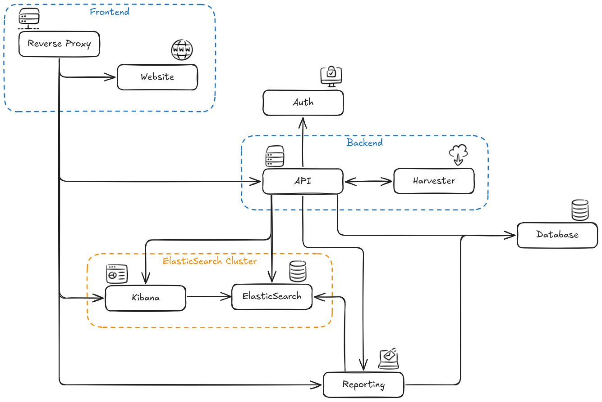

# ezMESURE

Platform aggregating electronic resources usage statistics for the French researcher organizations.

https://ezmesure.couperin.org

---

## Table of contents

- [✨ Features](#-features)
- [⚡ Quickstart](#-quickstart)
  - [🛠️ Prerequisites](#-prerequisites)
  - [📦 Install](#-install)
  - [⚙️ Configure](#-configure)
    - [🌐 HTTPS](#-https)
    - [👥 OpenID Connect](#-openid-connect)
  - [🚀 Start application](#-start-application)
  - [🔃 Update application](#-update-application)
- [🏗️ Architecture](#-architecture)
- [🧪 Development](#-development)
  - [🔒 SATOSA (optional)](#-satosa-optional)
- [👷 Build](#-build)

---

## ✨ Features

- **Centralized repository**: ezMESURE is a repository centralizing the usage data of electronic documentation of higher education and research institutions.
- **Data produced by ezPAARSE**: The data is produced by the various local institutional [ezPAARSE](https://github.com/ezpaarse-project/ezpaarse) entities before being aggregated in ezMESURE.
- **COUNTER harvesting**: ezMESURE includes all the tools to harvest COUNTER-compliant reports directly from publisher platforms before aggregating them into [ElasticSearch](https://www.elastic.co/elasticsearch) indices, allowing users to consult data through [Kibana](https://www.elastic.co/kibana) dashboards.
- **Regular PDF reports**: Integrated with [ezREEPORT](https://github.com/ezpaarse-project/ezreeport), ezMESURE can send condensed reports in PDF format on a recurring basis.

## ⚡ Quickstart

In order to self-host your own ezMESURE instance, you'll need to fulfill some requirements, install the application and configure it.

### 🛠️ Prerequisites

- [Docker](https://www.docker.com/) or [Podman](https://podman.io/)
- OIDC provider (like [Keycloak](https://www.keycloak.org/), [Authelia](https://www.authelia.com/) and so on)
- Production-ready [ElasticSearch](https://www.elastic.co/elasticsearch) cluster with [Kibana](https://www.elastic.co/kibana)
  - ezMESURE will manage a big part of the cluster and so it is recommended to have it's own cluster
  - ezMESURE only support version 7 for now, it is however planned to support ElasticSearch/Kibana 9
- A dedicated DNS entry
- SSL certificates for the domain serving ezMESURE (if not using your own reverse proxy, see [HTTPS](#-https) for more details)

### 📦 Install

A `compose` example is available with some default env variables, but feel free to customise it to match your needs.

```bash
# Download only needed files
curl -o compose.yml https://raw.githubusercontent.com/ezpaarse-project/ezmesure/refs/heads/master/compose.yml
curl -o .env https://raw.githubusercontent.com/ezpaarse-project/ezmesure/refs/heads/master/.env.example
```

> [!IMPORTANT]
> The `compose.yml` doesn't include an OIDC provider and doesn't include a ElasticSearch cluster with Kibana. You have to provide your own and configure ezMESURE to use it (see [⚙️ Configure](#-configure)).
>
> Here's a few links to help :
>
> - [Install ElasticSearch with Docker](https://www.elastic.co/guide/en/elasticsearch/reference/7.17/docker.html)
> - [Install Kibana with Docker](https://www.elastic.co/guide/en/kibana/7.17/docker.html)

> [!TIP]
> You can use the compose file `docker/elastic.compose.yml` to have a single-node ElasticSearch cluster (non production ready). It is used for development purposes but you can base your own from it.
>
> You can use the compose file `docker/dex.compose.yml` to have non production ready [Dex](https://dexidp.io/) as a OIDC provider. It is used for development purposes but you can base your own from it.

### ⚙️ Configure

ezMESURE needs several environment variables to be properly started. You can directly edit variables present in the `.env` file.

Here's the minimal variables needed to be set to have a production instance :

```.env
# .env

# How to connect to the ElasticSearch cluster
# Option 1: Set every part of URL
ELASTICSEARCH_SCHEME=http
ELASTICSEARCH_HOST=elastic.localhost
ELASTICSEARCH_PORT=9200
# Option 2: Set the full URL
ELASTICSEARCH_URL=http://elastic.localhost:9200
# Credentials used to administrate the ElasticSearch cluster
EZMESURE_ELASTICSEARCH_USERNAME=elastic
EZMESURE_ELASTICSEARCH_PASSWORD=changeme
# Credentials used to generate reports
# Set this to a user having "run_as" and "monitor" privileges on the ElasticSearch Cluster
# Option 1: Set username/password
EZREEPORT_ELASTICSEARCH_USERNAME=elastic
EZREEPORT_ELASTICSEARCH_PASSWORD=changeme
# Option 2: Set API Key generated from cluster
EZREEPORT_ELASTICSEARCH_API_KEY=

# Connection options of Kibana (on the same ElasticSearch cluster)
# Option 1: Set every part of URL
KIBANA_HOST=kibana.localhost
KIBANA_PORT=5601
# Option 2: Set the full URL
KIBANA_URL=http://kibana.localhost:5601
# Credentials used to administrate Kibana
# Note that the API will change the password for this user to the one provided
EZMESURE_KIBANA_USERNAME=kibana_system
EZMESURE_KIBANA_PASSWORD=changeme

# Password to protect redis instance
REDIS_PASSWORD=changeme

# Connection options of mail server
SMTP_HOST=smtp.localhost
SMTP_PORT=25
# Should use TLS immediately -> Set to "true" if using port 465, "false" (auto) otherwise
SMTP_SECURE=false
# Should ignore TLS support -> Set to "false" to use TLS (if available)
SMTP_IGNORE_TLS=false
# Should reject invalid TLS certificates
SMTP_REJECT_UNAUTHORIZED=false

# Connection options of Postgres
POSTGRES_HOST=postgres
POSTGRES_PORT=5432
# Credentials used to connect to Postgres
# Set this to a user having rights on "ezmesure" and "ezreeport"
POSTGRES_USER=postgres
POSTGRES_PASSWORD=changeme

# Mail address to use when ezMESURE send mails
EZMESURE_NOTIFICATIONS_SENDER="ezMESURE <noreply@ezmesure.localhost>"
# Mail address to use when ezREEPORT send reports
EZREEPORT_EMAIL_SENDER="ezREEPORT <noreply@ezreeport.localhost>"
# Mail address to add as a "reply-to" header
EZMESURE_NOTIFICATIONS_REPLY_TO=
# Mail addresses to send reports error and failed reports
EZREEPORT_EMAIL_SUPPORT_TEAM=

# The public domain of your ezMESURE instance
EZMESURE_DOMAIN=ezmesure.localhost
# The public port needed to access your ezMESURE instance (you can skip it if using 80 on HTTP and 443 on HTTPS)
EZMESURE_PUBLIC_PORT=8880

# Default locale of the app
EZMESURE_DEFAULT_LOCALE=fr

# Secret to sign JWT used to interact with the API
# Needs to be 32bytes
EZMESURE_AUTH_SECRET="<auth secret to persist>"

# Key to interact with ezREEPORT admin API, ezMESURE uses it to sync data
EZREEPORT_ADMIN_KEY="<api key to save somewhere>"
```

You can find all the available variables in the [`.env`](./.env) file.

#### 🌐 HTTPS

**ezMESURE needs to be served over HTTPS** either with your own reverse proxy (Caddy, Traefik, etc.) or by the reverse proxy included with ezMESURE.

ezMESURE and ezREEPORT uses websockets to ensure some features, please ensure websocket support is included in your reverse proxy.

##### Using the included reverse proxy

You'll need SSL certificate, you can generate them with [`mkcert`](https://github.com/FiloSottile/mkcert) or `openssl`.

1. Update the `compose.yml` file (you can use a `compose.override.yml`) to add a volume providing SSL certificate:

```yaml
# compose.override.yml

services:
  front:
    ports:
      - 8443:443
    volumes:
      - ./path/to/certificate/file.crt:/etc/nginx/ssl/cert.pem
      - ./path/to/certificate/private-key.pem:/etc/nginx/ssl/key.pem
```

2. Update the `.env` file to change needed environment variables:

```.env
# .env

NGINX_PROTOCOL=https
EZMESURE_PUBLIC_PORT=":8443"
```

##### Using an external reverse proxy

1. Update the `.env` file to change needed environment variables:

```.env
# .env

NGINX_PROTOCOL=http
EZMESURE_PUBLIC_PORT="" # Or match your RP public port
```

2. Configure your reverse proxy

Here's a few configuration examples for popular reverse proxies :

<details>

<summary>Traefik</summary>

In this example:

- ezMESURE is served under `ezmesure.localhost`, you must change to match your DNS configuration.

```yaml
# compose.override.yml
services:
  front:
    labels:
      - traefik.enable=true
      - traefik.http.routers.ezmesure.rule=Host('ezmesure.localhost')
      - traefik.http.routers.ezmesure.entrypoint=websecure
      - traefik.http.routers.ezmesure.tls=true
      # Use let's encrypt to generate certificates, you can use any certresolver
      - traefik.http.routers.ezmesure.tls.certresolver=letsencrypt
      - traefik.http.routers.ezmesure.tls.domains[0].main=ezmesure.localhost
      - traefik.http.services.ezmesure.loadbalancer.server.port=80
```

</details>

<details>

<summary>NGINX</summary>

In this example:

- ezMESURE is served under `ezmesure.localhost`, you must change to match your DNS configuration
- SSL certificate is in `/etc/nginx/ssl/cert.pem` and private key in `/etc/nginx/ssl/key.pem`, you should change to match your configuration
- ezMESURE reverse proxy is assumed to be in the same docker network, you should change the `proxy_pass` directive to match your configuration

```nginx
server {
  server_name ezmesure.localhost;

  listen 80;
  listen [::]:80;

  location / {
    return 301 https://ezmesure.localhost$request_uri;
  }
}

server {
  server_name ezmesure.localhost;

  listen 443 ssl;
  listen [::]:443 ssl;

  ## Certificates
  ssl_certificate /etc/nginx/ssl/cert.pem;
  ssl_certificate_key /etc/nginx/ssl/key.pem;

  proxy_set_header  X-Forwarded-Host   $host;
  proxy_set_header  X-Forwarded-Server $host;
  proxy_set_header  X-Forwarded-For    $proxy_add_x_forwarded_for;
  proxy_hide_header X-Powered-By;

  location / {
    proxy_http_version 1.1;
    proxy_set_header Upgrade $http_upgrade;
    proxy_set_header Connection "upgrade";
    proxy_set_header Host $host;
    proxy_cache_bypass $http_upgrade;

    proxy_pass  http://front:80/;
  }

  ## Diffie-Hellman
  ssl_ecdh_curve secp384r1;

  ## Protocol
  ssl_protocols TLSv1.2;

  ## Cipher suite
  ssl_ciphers EECDH+AESGCM:EECDH+CHACHA20:EECDH+AES;
  ssl_prefer_server_ciphers on;

  ## HTTP Strict Transport Security
  add_header Strict-Transport-Security "max-age=15552000; preload";
}

```

</details>

<details>

<summary>Caddy</summary>

In this example:

- ezMESURE is served under `ezmesure.localhost`, you must change to match your DNS configuration
- ezMESURE reverse proxy is assumed to be in the same docker network, you should change the `reverse_proxy` directive to match your configuration

```caddyfile
ezmesure.localhost {
  # By default, Caddy generates certificates with Let's Encrypt and redirects HTTP to HTTPS
  reverse_proxy http://front:80
}
```

</details>

#### 👥 OpenID Connect

> [!IMPORTANT]
> When configuring your OpenID provider, be sure to register the following redirect URI with the provider: `https://${EZMESURE_DOMAIN}${EZMESURE_PUBLIC_PORT}/api/auth/oauth/login/callback`

ezMESURE delegates user authentication to an OIDC server, edit the `.env` file to updated needed environment variables:

```.env
#.env

# client_id given by the provider
EZMESURE_OIDC_CLIENT_ID="<client_id from provider>"
# client_sercret given by the provider
EZMESURE_OIDC_CLIENT_SECRET="<client_secret from provider>"

# If your OpenID provider supports discovery:
EZMESURE_OIDC_DISCOVERY_URI=https://auth.localhost/.well-known/openid-configuration

# If your OpenID provider DOES NOT supports discovery:
EZMESURE_OIDC_ISSUER_URI=https://auth.localhost
EZMESURE_OIDC_AUTH_URI=https://auth.localhost/auth
EZMESURE_OIDC_TOKEN_URI=https://auth.localhost/token
EZMESURE_OIDC_INTROSPECTION_URI=https://auth.localhost/token/introspect
EZMESURE_OIDC_REVOCATION_URI=https://auth.localhost/token/revoke
EZMESURE_OIDC_USERINFO_URI=https://auth.localhost/userinfo

# scopes to request to the provider, this is the default value
EZMESURE_OIDC_SCOPES=["openid","profile","email","offline_access"]

# Link to the "My Profile" page, makes it available for users (optional)
EZMESURE_OIDC_PROFILE_PAGE=

# Data for the default user (app admin)
# Should match someone in your IDP to allow login
EZMESURE_ADMIN_USERNAME=admin
EZMESURE_ADMIN_FULLNAME=ezmesure-admin
EZMESURE_ADMIN_EMAIL=admin@ezmesure.localhost
```

### 🚀 Start application

Once configured, you can start ezMESURE using the following commands :

```bash
# Start application
docker compose up -d

# Access to logs
docker compose logs [api|front]

# Stop application
docker compose down
```

> [!WARNING]  
> If using `podman compose`:
>
> - You might encounter migration issues as it does not supports (yet) the `pre_start` and `post_start` directives.
>   - You can use `podman compose run --rm "..."` to execute the scripts
> - You'll need to add the following environment variable to the `.env` file :
>
> ```.env
> # .env
> NGINX_RESOLVER=10.89.0.1
> ```

### 🔃 Update application

To update ezMESURE (we're pushing 2 releases every month on average), you can run the following command :

> [!TIP]
> The following commands assume you use the `latest` (and `stable` for ezREEPORT) tags.
>
> However, you can pin version numbers in `compose.yml` (or use a `compose.override.yml`) and manually update them before running commands.

```bash
# Pull images
docker compose pull
# Stop application
docker compose down
# Restart application
docker compose up -d
```

## 🏗️ Architecture



The application is made of 2 essentials components :

- **Backend**: a NodeJS HTTP API and a NodeJS sub-process (used to harvest COUNTER APIs)
- **Frontend**: a NGINX serving the static Vue frontend and proxying requests to API, Kibana and ezREEPORT

ezMESURE uses :

- [PostgreSQL](https://www.postgresql.org/) to store management data (institutions, users, etc.)
- [ElasticSearch](https://www.elastic.co/elasticsearch) to store usage data (with indices) and managing user access to data
- [Kibana](https://www.elastic.co/kibana) to display usage data, the application will create spaces and manage user access to spaces
- [ezREEPORT](https://github.com/ezpaarse-project/ezreeport) to send PDF reports by mail
  - It will use [RabbitMQ](https://www.rabbitmq.com/) for internal communication
  - It will use [PostgreSQL](https://www.postgresql.org/) to store report data
- [Redis](https://redis.io/) to queue COUNTER harvest jobs
- An OIDC Provider to manage user authentication

## 🧪 Development

You should clone the repository using `git` and install dependencies of both services :

```bash
# Clone project
git clone https://github.com/ezpaarse-project/ezmesure.git
cd ezmesure
# Install dependencies
npm --prefix api ci
npm --prefix front ci
# Setup environment
cp .env.example .env
```

It contains configuration files for running and developing ezMESURE. There's a dedicated `compose.dev.yml` (extending default `compose.yml`) to ease development.

Unlike production setup, the development setup are including an OIDC provider ([Dex](https://dexidp.io/)) and a single-node ElasticSearch cluster preconfigured to be used by ezMESURE, so the prerequisites are a bit different :

> [!CAUTION]
> ElasticSearch has some [system requirements](https://www.elastic.co/docs/deploy-manage/deploy/self-managed/important-system-configuration) that you should check.
>
> To avoid memory exceptions, you may have to increase maps count. Edit `/etc/sysctl.conf` and add the following line :
>
> ```ini
> vm.max_map_count=262144
> ```

- [Docker](https://www.docker.com/) or [Podman](https://podman.io/)
- A dedicated DNS entry
  - Example environment uses `ezmesure.localhost`, you can change it by setting `EZMESURE_DOMAIN` in the `.env` file
  - You can edit `/etc/hosts`
  - You can also use tools like [`localias`](https://github.com/peterldowns/localias)
    - If using `localias` (or other tools providing a reverse proxy) you'll need to `EZMESURE_PUBLIC_PORT` to `""`
- SSL certificates for the domain serving ezMESURE
  - Set `NGINX_PROTOCOL=https` in the `.env` file
  - Internal reverse proxy expect the following locations:
    - Certificate: `./docker/certs/cert.pem`
    - Private key: `./docker/certs/key.pem`
    - Authority: `./docker/certs/ca.pem`
  - You can use tools like `openssl` or [`mkcert`](https://github.com/FiloSottile/mkcert)
  - `localias` already includes a reverse proxy so you can skip the port in `EZMESURE_DOMAIN` the certificate and the private key (CA is still needed)

Once prerequisites are fulfilled, you can start dev server by running :

```bash
# Start application in dev mode
docker compose -f compose.dev.yml up -d
```

Development setup already includes watch mode (for api) and hot module reloading (for front). So you can edit the code and watch changes go live.

> [!WARNING]
> If using `podman compose`:
>
> - You might encounter migration issues as it does not supports (yet) the `pre_start` and `post_start` directives.
>   - You can use `podman compose -f compose.dev.yml run --rm "..."` to execute the scripts
> - You'll need to add the following environment variable to the `.env` file :
>
> ```.env
> # .env
> NGINX_RESOLVER=10.89.0.1
> ```

### 🔒 SATOSA (optional)

If you want to test SATOSA to test signin from the [fédération d'identités Education-Recherche](https://federation.renater.fr/registry?action=get_all), you'll have additional configuration to do

- Add a dedicated DNS entry
- Put the certificate (`sp.crt`) and private key (`sp.key`) and the certificate used to sign the metadata file (`metadata.crt`) into `./docker/satosa/certs/`

> [!NOTE]
> If you're enabling SATOSA and SSL with the internal reverse proxy, SSL certificates should cover both hostnames

> [!TIP]
> You might have to change your `EZMESURE_DOMAIN` and `EZMESURE_PUBLIC_PORT` to match SP declaration

And run the dedicated compose file to have a running instance of SATOSA with ezMESURE, RP and Dex pre-configured :

```bash
# Start application in dev mode with SATOSA
docker compose -f compose.dev.yml -f compose.dev-satosa.yml up -d
```

## 👷 Build

There's a `compose.build.yml` (extending `compose.yml`) dedicated to building and pushing images

```bash
# Build local images
docker compose -f compose.build.yml build

# Start application with local images (useful to test one last time)
docker compose -f compose.build.yml up -d

# Push local images to registry
docker compose -f compose.build.yml push
```
